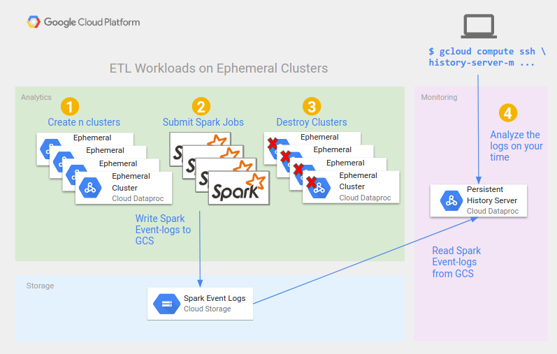

# Dataproc Persistent History Server
This repo houses the example code for a blog post on using a persistent history
server to view job history about your Spark / MapReduce jobs and
aggregated YARN logs from short-lived clusters on GCS.



## Directory structure
- `cluster_templates/`
  - `history_server.yaml`
  - `ephemeral_cluster.yaml`
- `init_actions`
  - `disable_history_servers.sh`
- `workflow_templates`
  - `spark_mr_workflow_template.yaml`
- `terraform`
  - `variables.tf`
  - `network.tf`
  - `history-server.tf`
  - `history-bucket.tf`
  - `long-running-cluster.tf`
  - `firewall.tf`
  - `service-account.tf`

## Usage
The recommended way to run this example is to use terraform as it creates a vpc network
to run the example with the appropriate firewall rules.

### Enabling services
```
gcloud services enable \
compute.googleapis.com \
dataproc.googleapis.com
```

### Pre-requisites
- [Install Google Cloud SDK](https://cloud.google.com/sdk/)
- Enable the following APIs if not already enabled.
  - `gcloud services enable compute.googleapis.com dataproc.googleapis.com`
- \[Optional\] [Install Terraform](https://learn.hashicorp.com/terraform/getting-started/install.html)

### Disclaimer
This is for example purposes only. You should take a much closer look at the firewall
rules that make sense for your organization's security requirements.

### Should I run with Terraform or `gcloud` SDK ?
This repo provides artifacts to spin up the infrastructure for persisting
job history and yarn logs with terraform or with gcloud. The recommended
way to use this is to modify the Terraform code to fit your needs for
long running resources.

However, the cluster templates are included as an example of
standardiznig cluster creation for ephemeral clusters.
You might ask, "Why is there a cluster template for the history server?".
The history server is simply a cleaner interface for reading your logs
from GCS. For Spark, it is stateless and you may wish to only spin up
 a history server when you'll actually be using it. For MapReduce,
the history server will only be aware of the files on GCS when it was
created and those files which it moves from intermediate done directory
to the done directory. For this reason, MapReduce workflows should
use a persistent history server.

### Managing Log Retention
Often times, it makes sense to leave the history
server running because several teams may use it and you could configure
it to manage clean up of your logs by setting the following additional
properties:
 - `yarn:yarn.log-aggregation.retain-seconds`
 - `spark:spark.history.fs.cleaner.enabled`
 - `spark:spark.history.fs.cleaner.maxAge`
 - `mapred:mapreduce.jobhistory.cleaner.enable`
 - `mapred:mapreduce.jobhistory.max-age-ms`

### Terraform
To spin up the whole example you could simply edit the
`terraform.tfvars` file to set the variables to the
desired values and run the following commands.

Note, this assumes that you have an existing project and
the sufficient permissions to spin up the resources for this
example.
```
cd terraform
terraform init
terraform apply
```
This will create:
1. VPC Network and subnetwork for your dataproc clusters.
1. Various firewall rules for this network.
1. A single node dataproc history-server cluster.
1. A long running dataproc cluster.
1. A GCS Bucket for YARN log aggregation, and Spark MapReduce Job History
as well as initialization actions for your clusters.

### Alternatively, with Google Cloud SDK
These instructions detail how to run this entire example with `gcloud`.
1.  Replace `PROJECT` with your GCP project id in each file.
1.  Replace `HISTORY_BUCKET` with your GCS bucket for logs in each file.
1.  Replace `HISTORY_SERVER` with your dataproc history server.
1.  Replace `REGION` with your desired GCP Compute region.
1.  Replace `ZONE` with your desired GCP Compute zone.

```
cd workflow_templates
sed -i 's/PROJECT/your-gcp-project-id/g' *
sed -i 's/HISTORY_BUCKET/your-history-bucket/g' *
sed -i 's/HISTORY_SERVER/your-history-server/g' *
sed -i 's/REGION/us-central1/g' *
sed -i 's/ZONE/us-central1-f/g' *
sed -i 's/SUBNET/your-subnet-id/g' *

cd cluster_templates
sed -i 's/PROJECT/your-gcp-project-id/g' *
sed -i 's/HISTORY_BUCKET/your-history-bucket/g' *
sed -i 's/HISTORY_SERVER/your-history-server/g' *
sed -i 's/REGION/us-central1/g' *
sed -i 's/ZONE/us-central1-f/g' *
sed -i 's/SUBNET/your-subnet-id/g' *
```

Stage an empty file to create the spark-events path on GCS.

```
touch .keep
gsutil cp .keep gs://your-history-bucket/spark-events/.keep
rm .keep
```

Stage our initialization action for disabling history servers
on your ephemeral clusters.
```
gsutil cp init_actions/disable_history_servers.sh
```

Create the history server.

```sh
gcloud beta dataproc clusters import \
  history-server \
  --source=cluster_templates/history-server.yaml \
  --region=us-central1
```

Create a cluster which you can manually submit jobs to and tear down.

```sh
gcloud beta dataproc clusters import \
ephemeral-cluster \
--source=cluster_templates/ephemeral-cluster.yaml \
--region=us-central1
```

### Running the Workflow Template
Import the workflow template to run an example spark and hadoop job
to verify your setup is working.

```sh
gcloud dataproc workflow-templates import spark-mr-example \
--source=workflow_templates/spark_mr_workflow_template.yaml
```

Trigger the workflow template to spin up a cluster,
run the example jobs and tear it down.

```sh
gcloud dataproc workflow-templates instantiate spark-mr-example
```

### Viewing the History UI
Follow [these instructions](https://cloud.google.com/dataproc/docs/concepts/accessing/cluster-web-interfaces)
 to look at the UI by ssh tunneling to the history server.
Ports to visit:
 - MapReduce Job History: 19888
 - Spark Job History: 18080


### Closing Note
If you're adapting this example for your own use consider the following:
1. Setting an appropriate retention for your logs.
1. Setting more appropriate firewall rules for your security requirements.
