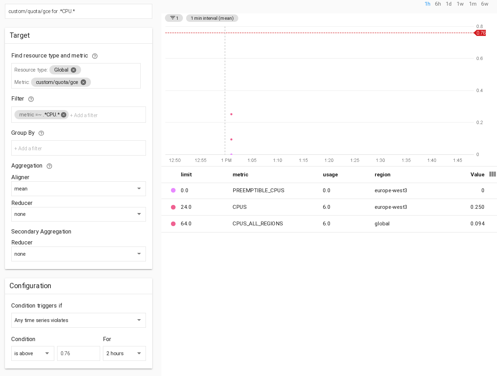

# GCE quota exporter

This tool serves a single, simple purpose: computing [GCE resource
quota](https://cloud.google.com/compute/quotas) usage and exporting it to
Stackdriver as [custom
metrics](https://cloud.google.com/monitoring/custom-metrics/), so that alert
rules can then be set to proactively monitor specific (or all) quotas.

It does this by:

* interfacing with the GCE API, and calling the
  [`projects.get`](https://cloud.google.com/compute/docs/reference/rest/v1/projects/get)
  and
  [`regions.get`](https://cloud.google.com/compute/docs/reference/rest/v1/regions/get)
  methods for global and regional quotas
* deriving current utilization (usage / limit) for each quota, then converting
  it into a time series
* writing the time series to Stackdriver in the
  `custom.googleapis.com/quota/gce` metric.


## Usage

The tool has been tested with Python 2.7, and can be used as a standalone
script, or deployed as a containerized image. It accepts a few simple
parameters:

* `--project` the GCP project id for which to fetch global quotas
  *(required)*
* `--gce-regions` comma-delimited list of GCE regions for which to
  fetch regional quotas
* `--stackdriver-logging` boolean flag to enable structured logging
  output to Stackdriver
* `--verbose` boolean flag to enable verbose logging output
* `--help` display the tool's help text

All command-line options also map to corresponding environment variables,
capitalized and prefixed with `OPT_`, which are used to configure the tool when
running inside a container. For example, `--project` can also be set
through the `OPT_PROJECT` variable, and so on.

### Standalone usage

Standalone usage requires a few prerequisite packages, listed in the
`requirements.txt` file. The simplest way to install them is to set up a
virtualenv:

```
virtualenv venv
. venv/bin/activate
pip install -r requirements.txt
```

The script can then be called directly.

### Deploy as a container

The provided `Dockerfile` wraps the tool in a simple container with the
prerequisite requirements installed. It's designed to periodically run the tool using
`cron`, as that's the typical deployment use.

Tool options are set through the environment variables discussed above, and the
update frequency can be controlled by setting the `CRONSPEC` variable to a valid
crontab schedule. The default is `0 * * * *`, so that the tool runs every hour.

## Stackdriver alerting

Resource quota usage is exported to the Stackdriver in the
`custom.googleapis.com/quota/gce` metric, with value set to the usage ratio
(`usage / limit`), and the following labels:

* `project`, eg `my-project-id`
* `region`, eg `europe-west3`
* `metric`, the actual quota value eg `CPU`
* `limit`, the quota limit
* `usage`, the quota usage

The metric can then be used in charts, but more importantly to set custom
alerts so as to monitor actual consumption, like in the following image:



This is an example of a written series:

```json
  {
   "metric": {
    "labels": {
     "limit": "24.0",
     "region": "europe-west3",
     "metric": "CPUS",
     "project": "my-project-id",
     "usage": "3.0"
    },
    "type": "custom.googleapis.com/quota/gce"
   },
   "resource": {
    "type": "global",
    "labels": {
     "project_id": "my-project-id"
    }
   },
   "metricKind": "GAUGE",
   "valueType": "DOUBLE",
   "points": [
    {
     "interval": {
      "startTime": "2018-10-10T13:25:27.642781Z",
      "endTime": "2018-10-10T13:25:27.642781Z"
     },
     "value": {
      "doubleValue": 0.125
     }
    }
    ]
  }
```
